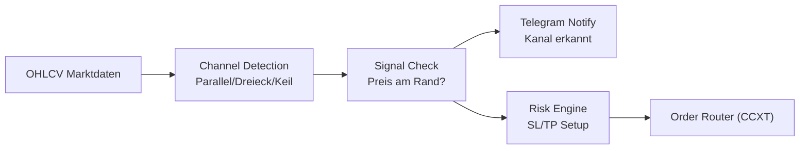

# 📊 KBot - Channel Pattern Trading Bot

<div align="center">


[](https://www.python.org/)
[](https://github.com/ccxt/ccxt)
[](LICENSE)

**Ein vollautomatisierter Trading-Bot für Krypto-Futures mit Chart-Kanal-Erkennung und automatischem Risikomanagement**

[Features](#-features) • [Installation](#-installation) • [Konfiguration](#-konfiguration) • [Live-Trading](#-live-trading) • [Monitoring](#-monitoring) • [Wartung](#-wartung)

</div>

---

## 📊 Übersicht

KBot ist ein spezialisierter Trading-Bot, der automatisch Chart-Kanäle (parallel, Dreieck, Keil) auf dem Kryptowährungsmarkt erkennt und eigenständig von Kanalrand zu Kanalrand handelt. Das System benötigt keine Machine-Learning-Modelle oder Trainings-Pipelines und ist optimiert für stabilen Betrieb auf Ubuntu-Servern.

### 🧭 Trading-Logik (Kurzfassung)
- **Channel Detection**: Automatische Erkennung von parallelen, dreieckigen und keilförmigen Chart-Kanälen
- **Signal-Engine**: Bei neuen Kanälen wird eine Telegram-Nachricht mit Typ und Koordinaten gesendet
- **Entry-Logik**: Automatischer Trade-Eröffnung am Kanalrand (Long unten, Short oben)
- **Risk Layer**: Fester Stop-Loss und Take-Profit basierend auf Kanal-Dimensionen
- **Execution**: CCXT für Order-Platzierung mit realistischer Slippage-Simulation

### 🔍 Strategie-Visualisierung


### 📈 Trade-Beispiel (Entry/SL/TP)
- **Setup**: Paralleler Kanal erkannt; oberer Widerstand bei 45.000, untere Unterstützung bei 43.000
- **Entry**: Long bei Touchpoint an untere Linie (43.000) mit Telegram-Alert
- **SL**: 2% unter Entry (42.140) zur Vermeidung von Fehlausbrüchen
- **TP**: An oberer Kanal-Linie (45.000) oder teilweise bei 44.000
- **Management**: Nach Erreichen von TP wird Position geschlossen; Kanal wird erneut gescannt

---

## 🚀 Features

### Trading Features
- ✅ Automatische Channel-Pattern-Erkennung (Parallel, Dreieck, Keil)
- ✅ Unterstützt mehrere Kryptowährungspaare (BTC, ETH, SOL, DOGE, etc.)
- ✅ Flexible Timeframe-Unterstützung (15m, 30m, 1h, 4h, 1d)
- ✅ Automatische Positionsgröße basierend auf verfügbarem Kapital
- ✅ Fester Stop-Loss und Take-Profit Management
- ✅ Telegram-Benachrichtigungen bei neuen Kanälen und Trades

### Technical Features
- ✅ CCXT Integration für mehrere Börsen
- ✅ Automatische Channel-Detektion mit Geometrie-Algorithmen
- ✅ Backtesting mit realistischer Slippage-Simulation
- ✅ Robust Error-Handling und Logging
- ✅ Keine ML/Deep-Learning-Abhängigkeiten (leichte Installation)

---

## 📋 Systemanforderungen

### Hardware
- **CPU**: Multi-Core Prozessor (Intel i5 oder besser empfohlen)
- **RAM**: Minimum 2GB, empfohlen 4GB+
- **Speicher**: 1GB freier Speicherplatz

### Software
- **OS**: Linux (Ubuntu 20.04+), macOS, Windows 10/11
- **Python**: Version 3.8 oder höher
- **Git**: Für Repository-Verwaltung

---

## 💻 Installation

### 1. Repository klonen

```bash
git clone <repository-url>
cd kbot
```

### 2. Automatische Installation (empfohlen)

```bash
# Linux/macOS
chmod +x install.sh
./install.sh

# Windows (PowerShell)
python -m venv .venv
.venv\Scripts\activate
pip install -r requirements.txt
```

Das Installations-Script führt folgende Schritte aus:
- ✅ Erstellt eine virtuelle Python-Umgebung (`.venv`)
- ✅ Installiert alle erforderlichen Abhängigkeiten
- ✅ Erstellt notwendige Verzeichnisse (`data/`, `logs/`, `artifacts/`)
- ✅ Initialisiert Konfigurationsdateien

### 3. API-Credentials konfigurieren

Erstelle eine `secret.json` Datei im Root-Verzeichnis:

```json
{
  "kbot": [
    {
      "name": "Bitget Trading Account",
      "exchange": "bitget",
      "apiKey": "DEIN_API_KEY",
      "secret": "DEIN_SECRET_KEY",
      "passphrase": "DEIN_PASSPHRASE",
      "options": {
        "defaultType": "future"
      }
    }
  ]
}
```

⚠️ **Wichtig**: 
- Niemals `secret.json` committen oder teilen!
- Verwende nur API-Keys mit eingeschränkten Rechten (Nur Trading, keine Withdrawals)
- Aktiviere IP-Whitelist auf der Exchange

### 4. Trading-Strategien konfigurieren

Bearbeite `settings.json` für deine gewünschten Handelspaare:

```json
{
  "live_trading_settings": {
    "active_strategies": [
      {
        "symbol": "BTC/USDT:USDT",
        "timeframe": "4h",
        "active": true
      },
      {
        "symbol": "ETH/USDT:USDT",
        "timeframe": "1h",
        "active": true
      }
    ]
  }
}
```

**Parameter-Erklärung**:
- `symbol`: Handelspaar (Format: BASE/QUOTE:SETTLE)
- `timeframe`: Zeitrahmen (15m, 30m, 1h, 4h, 1d)
- `active`: Strategie aktiv (true/false)

---

## 🔴 Live Trading

### Start des Live-Trading

```bash
# Master Runner starten (verwaltet alle aktiven Strategien)
python master_runner.py
```

### Manuell starten / Cronjob testen
Ausführung sofort anstoßen (ohne auf den 15-Minuten-Cron zu warten):

```bash
cd /home/ubuntu/kbot && /home/ubuntu/kbot/.venv/bin/python3 /home/ubuntu/kbot/master_runner.py
```

Der Master Runner:
- ✅ Lädt Konfigurationen aus `settings.json`
- ✅ Startet separate Prozesse für jede aktive Strategie
- ✅ Überwacht Kontostand und verfügbares Kapital
- ✅ Managed Positionen und Risk-Limits
- ✅ Loggt alle Trading-Aktivitäten
- ✅ Sendet Telegram-Benachrichtigungen für neue Kanäle

### Automatischer Start (Produktions-Setup)

Richte den automatischen Prozess für den Live-Handel ein.

```bash
crontab -e
```

Füge die folgende **eine Zeile** am Ende der Datei ein. Passe den Pfad an, falls dein Bot nicht unter `/home/ubuntu/kbot` liegt.

```
# Starte den KBot Master-Runner alle 15 Minuten
*/15 * * * * /usr/bin/flock -n /home/ubuntu/kbot/kbot.lock /bin/sh -c "cd /home/ubuntu/kbot && /home/ubuntu/kbot/.venv/bin/python3 /home/ubuntu/kbot/master_runner.py >> /home/ubuntu/kbot/logs/cron.log 2>&1"
```

*(Hinweis: `flock` ist eine gute Ergänzung, um Überlappungen zu verhindern, aber für den Start nicht zwingend notwendig.)*

Logverzeichnis anlegen:

```bash
mkdir -p /home/ubuntu/kbot/logs
```

### Als Systemd Service (Linux)

Für 24/7 Betrieb:

```bash
# Service-Datei erstellen
sudo nano /etc/systemd/system/kbot.service
```

```ini
[Unit]
Description=KBot Trading System
After=network.target

[Service]
Type=simple
User=your-user
WorkingDirectory=/path/to/kbot
ExecStart=/path/to/kbot/.venv/bin/python master_runner.py
Restart=always
RestartSec=10

[Install]
WantedBy=multi-user.target
```

```bash
# Service aktivieren
sudo systemctl enable kbot
sudo systemctl start kbot

# Status prüfen
sudo systemctl status kbot
```

---

## 📊 Monitoring & Status

### Status-Dashboard

```bash
# Zeigt alle wichtigen Informationen
./show_status.sh
```

**Angezeigt**:
- 📊 Aktuelle Konfiguration (`settings.json`)
- 🔐 API-Status (ohne Credentials)
- 📈 Offene Positionen
- 💰 Kontostand und verfügbares Kapital
- 📝 Letzte Logs

### Live-Status anzeigen

```bash
# Aktuelle Positionen und Performance
./show_results.sh
```

### Log-Files

```bash
# Live-Trading Logs (Zentrale Log-Datei)
tail -f logs/cron.log

# Fehler-Logs
tail -f logs/error.log

# Logs einer individuellen Strategie
tail -n 100 logs/kbot_BTCUSDTUSDT_4h.log
```

### Performance-Metriken

```bash
# Trade-Analyse
python analyze_real_trades_detailed.py

# Vergleich Backtest vs. Live
python compare_real_vs_backtest.py
```

---

## 🛠️ Wartung & Pflege

### Tägliche Verwaltung

#### Logs ansehen

Die zentrale `cron.log`-Datei enthält **alle** wichtigen Informationen vom Scheduler und den Handels-Entscheidungen.

  * **Logs live mitverfolgen (der wichtigste Befehl):**

    ```bash
    tail -f logs/cron.log
    ```

    *(Mit `Strg + C` beenden)*

  * **Die letzten 200 Zeilen der zentralen Log-Datei anzeigen:**

    ```bash
    tail -n 200 logs/cron.log
    ```

  * **Zentrale Log-Datei nach Fehlern durchsuchen:**

    ```bash
    grep -i "ERROR" logs/cron.log
    ```

#### Cronjob manuell testen

Um den `master_runner` sofort auszuführen, ohne auf den nächsten 15-Minuten-Takt zu warten:

```bash
cd /home/ubuntu/kbot && /home/ubuntu/kbot/.venv/bin/python3 /home/ubuntu/kbot/master_runner.py
```

### Bot aktualisieren

Um die neueste Version des Codes von deinem Git-Repository zu holen:

```bash
# Update aktivieren (einmalig)
chmod +x update.sh

# Update ausführen
bash ./update.sh
```

### Log-Rotation

```bash
# Alte Logs archivieren (älter als 30 Tage)
find logs/ -name "*.log" -type f -mtime +30 -exec gzip {} \;

# Archivierte Logs löschen (älter als 90 Tage)
find logs/ -name "*.log.gz" -type f -mtime +90 -delete
```

### Datenbank-Cleanup

```bash
# Alte Backtesting-Daten löschen
rm -rf data/backtest_cache/*

# Trade-History archivieren
mv logs/trades_*.csv logs/archive/
```

### Tests ausführen

```bash
# Alle Tests
./run_tests.sh

# Spezifische Tests
pytest tests/test_strategy.py
pytest tests/test_exchange.py -v

# Mit Coverage
pytest --cov=src tests/
```

---

## 🔧 Nützliche Befehle

### Konfiguration

```bash
# Settings validieren
python -c "import json; print(json.load(open('settings.json')))"

# Backup erstellen
cp settings.json settings.json.backup.$(date +%Y%m%d)

# Diff zwischen Versionen
diff settings.json settings.json.backup
```

### Prozess-Management

```bash
# Alle Python-Prozesse anzeigen
ps aux | grep python | grep kbot

# Master Runner Process-ID finden
pgrep -f master_runner.py

# Prozess sauber beenden
pkill -f master_runner.py

# Erzwungenes Beenden (Notfall)
pkill -9 -f master_runner.py
```

### Exchange-Verbindung

```bash
# API-Verbindung testen
python -c "from src.kbot.utils.exchange import Exchange; \
    e = Exchange('bitget'); print(e.fetch_balance())"

# Marktdaten abrufen
python -c "from src.kbot.utils.exchange import Exchange; \
    e = Exchange('bitget'); print(e.fetch_ohlcv('BTC/USDT:USDT', '1h'))"
```

### Debugging

```bash
# Verbose-Modus aktivieren
export KBOT_DEBUG=1
python master_runner.py

# Nur Strategie-Logs anzeigen
tail -f logs/cron.log | grep -i "channel\|trade\|position"

# Fehler im Detail
python -m pdb master_runner.py
```

---

## 📂 Projekt-Struktur

```
kbot/
├── src/
│   └── kbot/
│       ├── strategy/          # Trading-Logik
│       │   ├── run.py
│       │   └── channel_detector.py
│       ├── backtest/          # Backtesting
│       │   └── backtester.py
│       └── utils/             # Hilfsfunktionen
│           ├── exchange.py
│           └── telegram.py
├── scripts/                   # Hilfsskripte
├── tests/                     # Unit-Tests
├── data/                      # Marktdaten
├── logs/                      # Log-Files
├── artifacts/                 # Ergebnisse
│   ├── models/
│   └── backtest/
├── master_runner.py          # Haupt-Entry-Point
├── settings.json             # Konfiguration
├── secret.json               # API-Credentials
└── requirements.txt          # Dependencies
```

---

## ⚠️ Wichtige Hinweise

### Risiko-Disclaimer

⚠️ **Trading mit Kryptowährungen birgt erhebliche Risiken!**

- Nur Kapital einsetzen, dessen Verlust Sie verkraften können
- Keine Garantie für Gewinne
- Vergangene Performance ist kein Indikator für zukünftige Ergebnisse
- Testen Sie ausgiebig mit Demo-Accounts
- Starten Sie mit kleinen Beträgen

### Security Best Practices

- 🔐 Niemals API-Keys mit Withdrawal-Rechten verwenden
- 🔐 IP-Whitelist auf Exchange aktivieren
- 🔐 2FA für Exchange-Account aktivieren
- 🔐 `secret.json` niemals committen (in `.gitignore`)
- 🔐 Regelmäßige Security-Updates durchführen

### Performance-Tipps

- 💡 Starten Sie mit 1-2 Strategien
- 💡 Verwenden Sie längere Timeframes (4h+) für stabilere Signale
- 💡 Monitoren Sie regelmäßig die Performance
- 💡 Channel-Parameter regelmäßig überprüfen
- 💡 Position-Sizing angemessen konfigurieren

---

## 🤝 Support & Community

### Probleme melden

Bei Problemen oder Fragen:

1. Prüfen Sie die Logs in `logs/`
2. Führen Sie Tests aus: `./run_tests.sh`
3. Öffnen Sie ein Issue auf GitHub mit:
   - Beschreibung des Problems
   - Relevante Log-Auszüge
   - System-Informationen
   - Schritte zur Reproduktion

### Updates erhalten

```bash
# Regelmäßig Updates prüfen
git fetch origin
git status

# Updates installieren
./update.sh
```

---

## 📜 Lizenz

Dieses Projekt ist lizenziert unter der MIT License - siehe [LICENSE](LICENSE) Datei für Details.

---

## 🙏 Credits

Entwickelt mit:
- [CCXT](https://github.com/ccxt/ccxt) - Cryptocurrency Exchange Trading Library
- [Pandas](https://pandas.pydata.org/) - Data Analysis Library
- [TA-Lib](https://github.com/mrjbq7/ta-lib) - Technical Analysis Library

---

<div align="center">

**Made with ❤️ by the KBot Team**

⭐ Star uns auf GitHub wenn dir dieses Projekt gefällt!

[🔝 Nach oben](#-kbot---channel-pattern-trading-bot)

</div>
