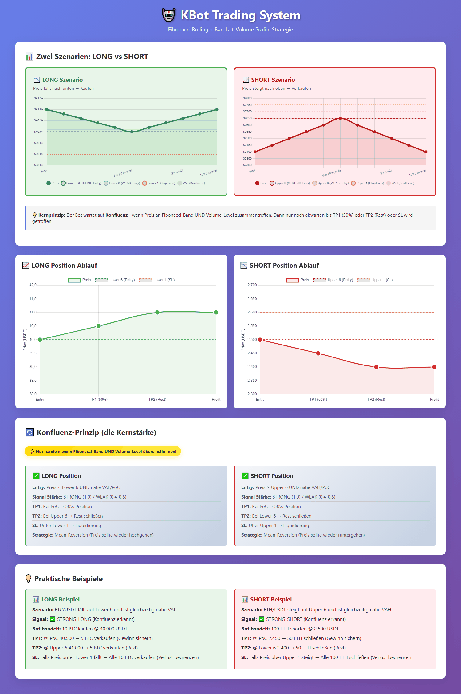
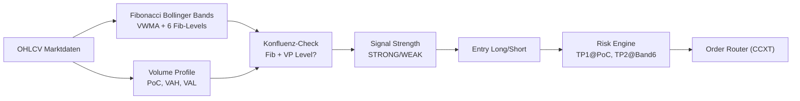

# 📊 KBot - Fibonacci Bollinger Bands + Volume Profile Trading Bot

<div align="center">


[](https://www.python.org/)
[](https://github.com/ccxt/ccxt)
[](LICENSE)

**Ein vollautomatisierter Trading-Bot für Krypto-Futures mit Fibonacci Bollinger Bands, Volume Profile Konfluenz und automatischem Risikomanagement**

[📊 **Interaktive Illustration öffnen**](kbot_illustration.html) • [Features](#-features) • [Installation](#-installation) • [Konfiguration](#-konfiguration) • [Live-Trading](#-live-trading) • [Pipeline](#-interaktives-pipeline-script) • [Monitoring](#-monitoring--status) • [Wartung](#-wartung)



</div>

---

##  Übersicht

KBot ist ein spezialisierter Trading-Bot, der **Fibonacci Bollinger Bands** kombiniert mit **Volume Profile Analyse** nutzt, um hochwertige Mean-Reversion-Trades auf dem Kryptowährungsmarkt zu identifizieren. Das System handelt nur bei Konfluenz von technischen Bändern und Volume-Levels für maximale Signalqualität.

### 🧭 Trading-Logik (Kurzfassung)
- **Fibonacci Bollinger Bands**: VWMA-basierte Bänder mit 6 Fibonacci-Levels (0.236, 0.382, 0.5, 0.618, 0.764, 1.0)
- **Volume Profile**: PoC (Point of Control), VAH (Value Area High), VAL (Value Area Low) Berechnung
- **Konfluenz-Filter**: Entry nur wenn Fib-Band UND Volume-Level übereinstimmen
- **Entry-Logik**: Long bei lower_6 + nahe VAL/PoC, Short bei upper_6 + nahe VAH/PoC
- **Take-Profit**: TP1 bei PoC (50%), TP2 bei gegenüberliegendem Band 6
- **Stop-Loss**: Band 1 als Stop-Loss-Level (Long: lower_1, Short: upper_1)

### 🔍 Strategie-Visualisierung

```mermaid
flowchart LR
    A["OHLCV Marktdaten"]
    B["Fibonacci Bollinger Bands<br/>VWMA + 6 Fib-Levels"]
    C["Volume Profile<br/>PoC, VAH, VAL"]
    D["Konfluenz-Check<br/>Fib + VP Level?"]
    E["Signal Strength<br/>STRONG/WEAK"]
    F["Entry Long/Short"]
    G["Risk Engine<br/>TP1@PoC, TP2@Band6"]
    H["Order Router (CCXT)"]

    A --> B --> D
    A --> C --> D
    D --> E --> F --> G --> H
```

### 📈 Trade-Beispiel (Entry/SL/TP)
- **Setup**: Fib BB + Volume Profile berechnet; Preis fällt zum lower_6 UND ist nahe VAL
- **Signal**: STRONG_LONG (hohe Konfluenz = hohe Signalqualität)
- **Entry Long**: Automatischer Einstieg bei Konfluenz
- **TP1**: Bei PoC (Point of Control) - 50% Position schließen
- **TP2**: Bei upper_6 - Rest schließen
- **SL**: Unter lower_1

---

## 🚀 Features

### Trading Features
- ✅ **Fibonacci Bollinger Bands** Strategie mit 6 Fibonacci-Levels
- ✅ **Volume Profile Integration** - PoC, VAH, VAL Berechnung
- ✅ **Konfluenz-basierte Entries** - nur bei Fib + VP Übereinstimmung
- ✅ **VWMA-basierte** Berechnung (Volume Weighted Moving Average)
- ✅ **Long & Short Trading** - bidirektionale Mean-Reversion
- ✅ **Dual Take-Profit** - TP1 bei PoC, TP2 bei Band 6
- ✅ Unterstützt mehrere Kryptowährungspaare (BTC, ETH, SOL, DOGE, etc.)
- ✅ Flexible Timeframe-Unterstützung (15m, 30m, 1h, 4h, 1d)
- ✅ Automatische Positionsgröße basierend auf verfügbarem Kapital
- ✅ Integriertes Stop-Loss (Band 1) und Take-Profit (Band 6) Management

### Technical Features
- ✅ CCXT Integration für mehrere Börsen (Bitget primär)
- ✅ Rolling Volume Profile Berechnung (200 Kerzen Lookback)
- ✅ Automatische Fibonacci-Band-Berechnung in Echtzeit
- ✅ Backtesting mit realistischer Slippage-Simulation
- ✅ Robust Error-Handling und Logging

### Fibonacci Bollinger Bands - Details

Die Strategie verwendet **6 Fibonacci-Level** auf jeder Seite der VWMA-Basislinie:

| Level | Fibonacci | Verwendung |
|-------|-----------|------------|
| Band 1 | 0.236 | Stop-Loss Level |
| Band 2 | 0.382 | - |
| Band 3 | 0.500 | Schwache Entry (mit VP Konfluenz) |
| Band 4 | 0.618 | - |
| Band 5 | 0.764 | - |
| Band 6 | 1.000 | Entry/Take-Profit Level |

### Volume Profile - Details

| Level | Beschreibung | Verwendung |
|-------|--------------|------------|
| **PoC** | Point of Control - Preis mit höchstem Volumen | TP1 (50%), stärkstes S/R |
| **VAH** | Value Area High - obere 68% des Volumens | Short Entry Konfluenz |
| **VAL** | Value Area Low - untere 68% des Volumens | Long Entry Konfluenz |

**Parameter:**
- **Fib Length**: 200 (VWMA-Periode)
- **Fib Multiplier**: 3.0 (Standardabweichungs-Multiplikator)
- **VP Lookback**: 200 Kerzen
- **VP Bars**: 50 Preis-Levels
- **VA Percent**: 68% (Standard Value Area)

---

## 📋 Systemanforderungen

### Hardware
- **CPU**: Multi-Core Prozessor (Intel i5 oder besser empfohlen)
- **RAM**: Minimum 2GB, empfohlen 4GB+
- **Speicher**: 1GB freier Speicherplatz

### Software
- **OS**: Linux (Ubuntu 20.04+), macOS, Windows 10/11
- **Python**: Version 3.8 oder höher
- **Git**: Für Repository-Verwaltung

---

## 💻 Installation

### 1. Repository klonen

```bash
git clone https://github.com/Youra82/kbot.git
cd kbot
```

### 2. Automatische Installation (empfohlen)

```bash
# Linux/macOS
chmod +x install.sh
./install.sh

# Windows (PowerShell)
python -m venv .venv
.venv\Scripts\activate
pip install -r requirements.txt
```

Das Installations-Script führt folgende Schritte aus:
- ✅ Erstellt eine virtuelle Python-Umgebung (`.venv`)
- ✅ Installiert alle erforderlichen Abhängigkeiten
- ✅ Erstellt notwendige Verzeichnisse (`data/`, `logs/`, `artifacts/`)
- ✅ Initialisiert Konfigurationsdateien

### 3. API-Credentials konfigurieren

Erstelle eine `secret.json` Datei im Root-Verzeichnis:

```json
{
  "kbot": [
    {
      "name": "Bitget Trading Account",
      "exchange": "bitget",
      "apiKey": "DEIN_API_KEY",
      "secret": "DEIN_SECRET_KEY",
      "passphrase": "DEIN_PASSPHRASE",
      "options": {
        "defaultType": "future"
      }
    }
  ]
}
```

⚠️ **Wichtig**: 
- Niemals `secret.json` committen oder teilen!
- Verwende nur API-Keys mit eingeschränkten Rechten (Nur Trading, keine Withdrawals)
- Aktiviere IP-Whitelist auf der Exchange

### 4. Trading-Strategien konfigurieren

Bearbeite `settings.json` für deine gewünschten Handelspaare:

```json
{
  "live_trading_settings": {
    "active_strategies": [
      {
        "symbol": "BTC/USDT:USDT",
        "timeframe": "4h",
        "active": true
      },
      {
        "symbol": "ETH/USDT:USDT",
        "timeframe": "1h",
        "active": true
      }
    ]
  }
}
```

### Parameter-Erklärung**:
- `symbol`: Handelspaar (Format: BASE/QUOTE:SETTLE)
- `timeframe`: Zeitrahmen (15m, 30m, 1h, 4h, 1d)
- `active`: Strategie aktiv (true/false)
- `use_macd_filter`: Optional - MACD-Filter für zusätzliche Signalbestätigung

---

## 🎯 Strategie-Logik im Detail

### Fibonacci Bollinger Bands Algorithmus

```python
# 1. VWMA (Volume Weighted Moving Average) berechnen
typical_price = (high + low + close) / 3
vwma = sum(typical_price * volume, length) / sum(volume, length)

# 2. Standardabweichung berechnen
stdev = std(typical_price, length)

# 3. Deviation mit Multiplikator
dev = multiplier * stdev  # Standard: 3.0

# 4. Fibonacci-Bänder generieren
fib_levels = [0.236, 0.382, 0.5, 0.618, 0.764, 1.0]
for fib in fib_levels:
    upper_band = vwma + (fib * dev)
    lower_band = vwma - (fib * dev)
```

### Entry/Exit Regeln

| Situation | Aktion | Level |
|-----------|--------|-------|
| Preis ≤ lower_6 | **Long Entry** | Unterstes Band |
| Preis ≥ upper_6 (Long) | **Long Exit (TP)** | Oberstes Band |
| Preis < lower_1 (Long) | **Long Exit (SL)** | Stop-Loss Level |
| Preis ≥ upper_6 | **Short Entry** | Oberstes Band |
| Preis ≤ lower_6 (Short) | **Short Exit (TP)** | Unterstes Band |
| Preis > upper_1 (Short) | **Short Exit (SL)** | Stop-Loss Level |

### Interaktive Visualisierung der Strategie

Öffne die **[KBot Trading System Illustration](kbot_illustration.html)** für eine interaktive, visuelle Erklärung:

- 📊 **LONG Szenario** - Preis fällt, Entry bei Lower 6, TP bei PoC & Upper 6
- 📊 **SHORT Szenario** - Preis steigt, Entry bei Upper 6, TP bei PoC & Lower 6
- 📈 **Live Charts** - Zeigt realistische Preisbewegungen und Konfluenz-Level
- 📋 **Detaillierte Regeln** - Entry-Signale, Take-Profit, Stop-Loss Erklärungen
- 💡 **Praktische Beispiele** - BTC/ETH Szenarien mit konkreten Zahlen

**Hinweis:** Speichere `kbot_illustration.html` lokal und öffne die Datei im Browser für die beste Erfahrung.

---

## 🔴 Live Trading

### Start des Live-Trading

```bash
# Master Runner starten (verwaltet alle aktiven Strategien)
python master_runner.py
```

### Manuell starten / Cronjob testen
Ausführung sofort anstoßen (ohne auf den 15-Minuten-Cron zu warten):

```bash
cd /home/ubuntu/kbot && /home/ubuntu/kbot/.venv/bin/python3 /home/ubuntu/kbot/master_runner.py
```

Der Master Runner:
- ✅ Lädt Konfigurationen aus `settings.json`
- ✅ Startet separate Prozesse für jede aktive Strategie
- ✅ Überwacht Kontostand und verfügbares Kapital
- ✅ Managed Positionen und Risk-Limits
- ✅ Loggt alle Trading-Aktivitäten
- ✅ Sendet Telegram-Benachrichtigungen für neue Kanäle

### Automatischer Start (Produktions-Setup)

Richte den automatischen Prozess für den Live-Handel ein.

```bash
crontab -e
```

Füge die folgende **eine Zeile** am Ende der Datei ein. Passe den Pfad an, falls dein Bot nicht unter `/home/ubuntu/kbot` liegt.

```
# Starte den KBot Master-Runner alle 15 Minuten
*/15 * * * * /usr/bin/flock -n /home/ubuntu/kbot/kbot.lock /bin/sh -c "cd /home/ubuntu/kbot && /home/ubuntu/kbot/.venv/bin/python3 /home/ubuntu/kbot/master_runner.py >> /home/ubuntu/kbot/logs/cron.log 2>&1"
```

*(Hinweis: `flock` ist eine gute Ergänzung, um Überlappungen zu verhindern, aber für den Start nicht zwingend notwendig.)*

Logverzeichnis anlegen:

```bash
mkdir -p /home/ubuntu/kbot/logs
```

### Als Systemd Service (Linux)

Für 24/7 Betrieb:

```bash
# Service-Datei erstellen
sudo nano /etc/systemd/system/kbot.service
```

```ini
[Unit]
Description=KBot Trading System
After=network.target

[Service]
Type=simple
User=your-user
WorkingDirectory=/path/to/kbot
ExecStart=/path/to/kbot/.venv/bin/python master_runner.py
Restart=always
RestartSec=10

[Install]
WantedBy=multi-user.target
```

```bash
# Service aktivieren
sudo systemctl enable kbot
sudo systemctl start kbot

# Status prüfen
sudo systemctl status kbot
```

---

## � Interaktives Pipeline-Script

Das **`run_pipeline.sh`** Script automatisiert die Parameter-Optimierung für deine Handelsstrategien. Es führt einen Grid-Search über die Fibonacci Bollinger Bands Parameter durch und findet die optimalen Einstellungen für dein ausgewähltes Symbol und Timeframe.

### Features des Pipeline-Scripts

✅ **Interaktive Eingabe** - Einfache Menü-Navigation  
✅ **Automatische Datumswahl** - Zeitrahmen-basierte Lookback-Berechnung  
✅ **Ladebalken** - Visueller Fortschritt mit tqdm  
✅ **Batch-Optimierung** - Mehrere Symbol/Timeframe-Kombinationen  
✅ **Automatisches Speichern** - Optimale Konfigurationen als JSON  
✅ **Integrierte Backtests** - Sofort nach Optimierung testen  

### Verwendung

```bash
# Pipeline starten
chmod +x run_pipeline.sh
./run_pipeline.sh
```

### Interaktive Eingaben

Das Script fragt dich nach folgende Informationen:

#### 1. Symbol eingeben
```
Welche(s) Symbol(e) möchtest du optimieren?
(z.B. BTC oder: BTC ETH SOL)
> BTC
```

#### 2. Timeframe eingeben
```
Welche(s) Timeframe(s)?
(z.B. 1d oder: 1d 4h 1h)
> 1d
```

#### 3. Startdatum eingeben
```
Startdatum (YYYY-MM-DD oder 'a' für automatisch)?
Automatische Optionen pro Timeframe:
  5m/15m    → 60 Tage Lookback
  30m/1h    → 180 Tage Lookback
  4h/2h     → 365 Tage Lookback
  6h/1d     → 730 Tage Lookback
> a
```

**Automatisches Datum**: Das Script berechnet das Startdatum basierend auf dem Timeframe:
- **5m/15m**: Letzte 60 Tage
- **30m/1h**: Letzte 180 Tage (6 Monate)
- **4h/2h**: Letzte 365 Tage (1 Jahr)
- **6h/1d**: Letzte 730 Tage (2 Jahre)

Oder gib manuell ein Datum ein:
```
Startdatum (YYYY-MM-DD oder 'a' für automatisch)?
> 2024-01-01
```

#### 4. Startkapital eingeben
```
Mit wieviel USD starten? (Standard: 100)
> 100
```

### Beispiel-Session

```bash
$ ./run_pipeline.sh

═══════════════════════════════════════════════════════════
     🤖 KBot - Interaktives Optimierungs-Pipeline
═══════════════════════════════════════════════════════════

Welche(s) Symbol(e) möchtest du optimieren?
(z.B. BTC oder: BTC ETH SOL)
> BTC ETH

Welche(s) Timeframe(s)?
(z.B. 1d oder: 1d 4h 1h)
> 1d 4h

Startdatum (YYYY-MM-DD oder 'a' für automatisch)?
[Info] Automatisches Datum:
  • BTC (1d): 2023-01-02
  • ETH (1d): 2023-01-02
  • BTC (4h): 2023-01-02
  • ETH (4h): 2023-01-02
> a

Mit wieviel USD starten? (Standard: 100)
> 500

═══════════════════════════════════════════════════════════
Starte Optimierung für folgende Strategien:
  • BTC (1d)
  • ETH (1d)
  • BTC (4h)
  • ETH (4h)
═══════════════════════════════════════════════════════════

[1/4] Optimiere BTC (1d) vom 2023-01-02 bis 2025-12-31...
Optimiere BTC (1d): 100%|█████████████| 243/243 [00:02<00:00, 110.65combo/s]

✅ OPTIMALE PARAMETER GEFUNDEN für BTC (1d)
  • Endkapital: $512.25
  • Gesamtrendite: 2.45%
  • Anzahl Trades: 3
  • Gewinnquote: 66.7%
  • Max Drawdown: -8.38%

[2/4] Optimiere ETH (1d) vom 2023-01-02 bis 2025-12-31...
Optimiere ETH (1d): 100%|█████████████| 243/243 [00:02<00:00, 115.32combo/s]

✅ OPTIMALE PARAMETER GEFUNDEN für ETH (1d)
  • Endkapital: $545.80
  • Gesamtrendite: 9.16%
  • Anzahl Trades: 5
  • Gewinnquote: 80.0%
  • Max Drawdown: -5.12%

[3/4] Optimiere BTC (4h) vom 2023-01-02 bis 2025-12-31...
[4/4] Optimiere ETH (4h) vom 2023-01-02 bis 2025-12-31...

═══════════════════════════════════════════════════════════
✅ Optimierung abgeschlossen!
Konfigurationen gespeichert unter: artifacts/optimal_configs/
═══════════════════════════════════════════════════════════

Möchtest du die Ergebnisse jetzt anschauen?
> y

[Startet show_results.sh...]
```

### Optimierte Konfigurationen

Nach erfolgreicher Optimierung werden die besten Parameter als JSON-Dateien gespeichert:

```
artifacts/optimal_configs/
├── optimal_BTCUSDT_1d.json
├── optimal_BTCUSDT_4h.json
├── optimal_ETHUSDT_1d.json
└── optimal_ETHUSDT_4h.json
```

**Beispiel-Konfiguration** (`optimal_BTCUSDT_1d.json`):

```json
{
  "symbol": "BTCUSDT",
  "timeframe": "1d",
  "parameters": {
    "length": 200,
    "multiplier": 3.0,
    "entry_level": "lower_6",
    "exit_level": "upper_6"
  },
  "performance": {
    "total_return": 12.45,
    "win_rate": 68.5,
    "num_trades": 8,
    "max_drawdown": -6.2,
    "end_capital": 1124.50
  },
  "timestamp": "2026-01-05T14:30:00.000000"
}
```

### Integration mit Live-Trading

Die optimierten Konfigurationen werden **automatisch geladen**, wenn du `show_results.sh` ausführst:

```bash
./show_results.sh
```

Das Script lädt die optimalen Parameter und nutzt sie für die Backtests:
- ✅ Bessere Ergebnisse durch optimierte Parameter
- ✅ Konsistente Strategie-Ausführung
- ✅ Einfaches A/B-Testing von Parametern

### Parameter-Grid

Das Pipeline-Script testet folgende Parameter-Kombinationen für die Fibonacci Bollinger Bands:

```
Length (VWMA-Periode):               [100, 150, 200, 250, 300]               (5 Werte)
Multiplier (Std-Dev Faktor):         [2.0, 2.5, 3.0, 3.5, 4.0]               (5 Werte)
Entry Level (Fibonacci):             [lower_5, lower_6]                       (2 Werte)
Exit Level (Fibonacci):              [upper_5, upper_6]                       (2 Werte)

Total = 5 × 5 × 2 × 2 = 100 Kombinationen
```

**Laufzeit**: ~15-30 Sekunden pro Symbol/Timeframe (mit tqdm Ladebalken)

**Scoring**: Jede Kombination wird bewertet mit:
- **Risk-Adjusted Return** = Total Return / |Max Drawdown|
- **Final Score** = Risk-Adjusted Return + (Win Rate × 0.5)

Die beste Kombination wird automatisch gespeichert.

### Troubleshooting

**Problem**: Script funktioniert nicht  
**Lösung**: Mache das Script ausführbar
```bash
chmod +x run_pipeline.sh
```

**Problem**: `command not found: date`  
**Lösung**: Unter Windows verwende WSL oder bash-kompatible Shell

**Problem**: Optimierung dauert sehr lange  
**Lösung**: Verwende weniger Symbol/Timeframe-Kombinationen oder weniger Daten

**Problem**: Keine Konfigurationen gefunden  
**Lösung**: Überprüfe Logs mit `tail -f logs/cron.log`

---

## �📊 Monitoring & Status

### Status-Dashboard

```bash
# Zeigt alle wichtigen Informationen
./show_status.sh
```

**Angezeigt**:
- 📊 Aktuelle Konfiguration (`settings.json`)
- 🔐 API-Status (ohne Credentials)
- 📈 Offene Positionen
- 💰 Kontostand und verfügbares Kapital
- 📝 Letzte Logs

### Live-Status anzeigen

```bash
# Aktuelle Positionen und Performance
./show_results.sh
```

### Log-Files

```bash
# Live-Trading Logs (Zentrale Log-Datei)
tail -f logs/cron.log

# Fehler-Logs
tail -f logs/error.log

# Logs einer individuellen Strategie
tail -n 100 logs/kbot_BTCUSDTUSDT_4h.log

# Nach Fibonacci-Band-Signalen suchen
tail -f logs/cron.log | grep -i "lower_6\|upper_6\|fib"
```

### Performance-Metriken

```bash
# Trade-Analyse
python analyze_real_trades_detailed.py

# Vergleich Backtest vs. Live
python compare_real_vs_backtest.py
```

---

## 🛠️ Wartung & Pflege

### Tägliche Verwaltung

#### Logs ansehen

Die zentrale `cron.log`-Datei enthält **alle** wichtigen Informationen vom Scheduler und den Handels-Entscheidungen.

  * **Logs live mitverfolgen (der wichtigste Befehl):**

    ```bash
    tail -f logs/cron.log
    ```

    *(Mit `Strg + C` beenden)*

  * **Die letzten 200 Zeilen der zentralen Log-Datei anzeigen:**

    ```bash
    tail -n 200 logs/cron.log
    ```

  * **Zentrale Log-Datei nach Fehlern durchsuchen:**

    ```bash
    grep -i "ERROR" logs/cron.log
    ```

#### Cronjob manuell testen

Um den `master_runner` sofort auszuführen, ohne auf den nächsten 15-Minuten-Takt zu warten:

```bash
cd /home/ubuntu/kbot && /home/ubuntu/kbot/.venv/bin/python3 /home/ubuntu/kbot/master_runner.py
```

### Bot aktualisieren

Um die neueste Version des Codes von deinem Git-Repository zu holen:

```bash
# Update aktivieren (einmalig)
chmod +x update.sh

# Update ausführen
bash ./update.sh
```

### Log-Rotation

```bash
# Alte Logs archivieren (älter als 30 Tage)
find logs/ -name "*.log" -type f -mtime +30 -exec gzip {} \;

# Archivierte Logs löschen (älter als 90 Tage)
find logs/ -name "*.log.gz" -type f -mtime +90 -delete
```

### Datenbank-Cleanup

```bash
# Alte Backtesting-Daten löschen
rm -rf data/backtest_cache/*

# Trade-History archivieren
mv logs/trades_*.csv logs/archive/
```

### Tests ausführen

```bash
# Alle Tests
./run_tests.sh

# Spezifische Tests
pytest tests/test_strategy.py
pytest tests/test_exchange.py -v

# Mit Coverage
pytest --cov=src tests/
```

---

## 🔧 Nützliche Befehle

### Konfiguration

```bash
# Settings validieren
python -c "import json; print(json.load(open('settings.json')))"

# Backup erstellen
cp settings.json settings.json.backup.$(date +%Y%m%d)

# Diff zwischen Versionen
diff settings.json settings.json.backup
```

### Prozess-Management

```bash
# Alle Python-Prozesse anzeigen
ps aux | grep python | grep kbot

# Master Runner Process-ID finden
pgrep -f master_runner.py

# Prozess sauber beenden
pkill -f master_runner.py

# Erzwungenes Beenden (Notfall)
pkill -9 -f master_runner.py
```

### Exchange-Verbindung

```bash
# API-Verbindung testen
python -c "from src.kbot.utils.exchange import Exchange; \
    e = Exchange('bitget'); print(e.fetch_balance())"

# Marktdaten abrufen
python -c "from src.kbot.utils.exchange import Exchange; \
    e = Exchange('bitget'); print(e.fetch_ohlcv('BTC/USDT:USDT', '1h'))"
```

### Debugging

```bash
# Verbose-Modus aktivieren
export KBOT_DEBUG=1
python master_runner.py

# Nur Strategie-Logs anzeigen
tail -f logs/cron.log | grep -i "fib\|band\|trade\|position\|lower_6\|upper_6"

# Fehler im Detail
python -m pdb master_runner.py
```

---

## 📂 Projekt-Struktur

```
kbot/
├── src/
│   └── kbot/
│       ├── strategy/          # Trading-Logik
│       │   ├── run.py         # Fibonacci Bollinger Bands Strategie
│       │   └── configs/       # Strategie-Konfigurationen
│       ├── analysis/          # Analyse-Tools
│       └── utils/             # Hilfsfunktionen
│           ├── exchange.py
│           └── telegram.py
├── tests/                     # Unit-Tests
├── data/                      # Marktdaten & Cache
├── logs/                      # Log-Files
├── artifacts/                 # Ergebnisse
│   ├── models/
│   ├── db/
│   └── optimal_configs/       # Optimierte Parameter
├── master_runner.py          # Haupt-Entry-Point
├── settings.json             # Konfiguration
├── secret.json               # API-Credentials
└── requirements.txt          # Dependencies
```

---

## ⚠️ Wichtige Hinweise

### Risiko-Disclaimer

⚠️ **Trading mit Kryptowährungen birgt erhebliche Risiken!**

- Nur Kapital einsetzen, dessen Verlust Sie verkraften können
- Keine Garantie für Gewinne
- Vergangene Performance ist kein Indikator für zukünftige Ergebnisse
- Testen Sie ausgiebig mit Demo-Accounts
- Starten Sie mit kleinen Beträgen

### Security Best Practices

- 🔐 Niemals API-Keys mit Withdrawal-Rechten verwenden
- 🔐 IP-Whitelist auf Exchange aktivieren
- 🔐 2FA für Exchange-Account aktivieren
- 🔐 `secret.json` niemals committen (in `.gitignore`)
- 🔐 Regelmäßige Security-Updates durchführen

### Performance-Tipps

- 💡 Starten Sie mit 1-2 Strategien
- 💡 Verwenden Sie längere Timeframes (4h+) für stabilere Fibonacci-Signale
- 💡 Monitoren Sie regelmäßig die Performance
- 💡 VWMA-Length und Multiplier regelmäßig überprüfen
- 💡 Position-Sizing angemessen konfigurieren
- 💡 Aktivieren Sie den MACD-Filter für zusätzliche Signal-Bestätigung

---

## 🤝 Support & Community

### Probleme melden

Bei Problemen oder Fragen:

1. Prüfen Sie die Logs in `logs/`
2. Führen Sie Tests aus: `./run_tests.sh`
3. Öffnen Sie ein Issue auf GitHub mit:
   - Beschreibung des Problems
   - Relevante Log-Auszüge
   - System-Informationen
   - Schritte zur Reproduktion

### Updates erhalten

```bash
# Regelmäßig Updates prüfen
git fetch origin
git status

# Updates installieren
./update.sh
```

### Optimierte Konfigurationen auf Repo hochladen

Nach erfolgreicher Parameter-Optimierung können die Konfigurationsdateien auf das Repository hochgeladen werden:

```bash
# Konfigurationsdateien auf Repository hochladen
git add src/kbot/strategy/configs/*.json
git commit -m "Update: Optimierte Strategie-Konfigurationen"
git push origin main --force
```

Dies sichert:
- ✅ **Backup** der optimierten Parameter
- ✅ **Versionierung** aller Konfigurationsänderungen
- ✅ **Deployment** auf mehrere Server mit konsistenten Einstellungen
- ✅ **Nachvollziehbarkeit** welche Parameter zu welchem Zeitpunkt verwendet wurden

---

## 📜 Lizenz

Dieses Projekt ist lizenziert unter der MIT License - siehe [LICENSE](LICENSE) Datei für Details.

---

## 🙏 Credits

Entwickelt mit:
- [CCXT](https://github.com/ccxt/ccxt) - Cryptocurrency Exchange Trading Library
- [Pandas](https://pandas.pydata.org/) - Data Analysis Library
- [TA-Lib](https://github.com/mrjbq7/ta-lib) - Technical Analysis Library

---

<div align="center">

**Made with ❤️ by the KBot Team**

⭐ Star uns auf GitHub wenn dir dieses Projekt gefällt!

[🔝 Nach oben](#-kbot---fibonacci-bollinger-bands-trading-bot)

</div>
